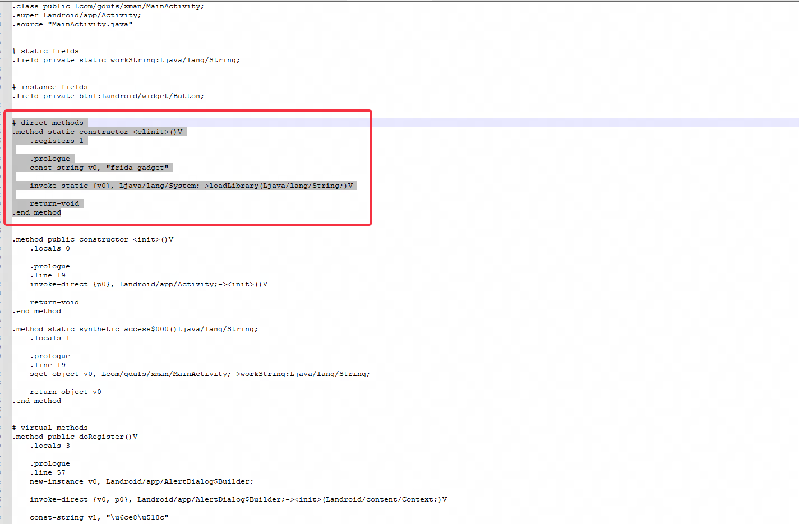

没有root情况下使用frida，需要注入frida-gadget.so，这里记录两个常用方法。

## Frida Gadget 非config配置模式

### 手搓插入frida-gadget

以xman的apk作为案例(ProjectDocs\UseToolsRecord\memDumpSO\xman.apk)，先使用apktool将apk反编译，这里用的是apktool 2.6.1，可以去[官网](https://bitbucket.org/iBotPeaches/apktool/downloads/)下载最新jar包，该方案是非持久化，需要使用电脑端。

#### lib放入so

```
java -jar tools\apktool_2.6.1.jar d  .\xman.apk -o out
```

反编译成功后，将下载对应frida版本的frida-gadget.so，我windows本地是15.2.2，将so放入lib目录下。


清单文件添加debug权限

打开out目录的清单文件，找到application，添加android:debuggable="true"。


#### 入口 smali添加load frida-gadget

清单文件可以看到入口是 MainActivity，添加load的smali

```
.method static constructor <clinit>()V
    .registers 1

    .prologue
    const-string v0, "frida-gadget"

    invoke-static {v0}, Ljava/lang/System;->loadLibrary(Ljava/lang/String;)V

    return-void
.end method
```



插入成功后，可以通过apktool回编，然后重签安装。

```
java -jar \tools\apktool_2.6.1.jar b  .\out -o killer.apk
```

正常启动apk后，可以使用frida命令进行查看进程。

如果遇到了 一下错误

```
F Frida: Failed to start: Unable to create socket: Permission denied
```

说明没有网络权限，需要添加网络权限

```
<uses-permission android:name="android.permission.INTERNET"/>
```

启动应用会卡住等端口监听

```
frida-ps -U |findstr get
12338  Gadget
```

可以对该进程进行hook；

```
frida -U Gadget -l .\xman.js
     ____
    / _  |   Frida 15.2.2 - A world-class dynamic instrumentation toolkit
   | (_| |
    > _  |   Commands:
   /_/ |_|       help      -> Displays the help system
   . . . .       object?   -> Display information about 'object'
   . . . .       exit/quit -> Exit
   . . . .
   . . . .   More info at https://frida.re/docs/home/
   . . . .
   . . . .   Connected to V1901A (id=YTQSUGTCV8M7AMUO)

[V1901A::Gadget ]-> MyApp :  aaaaa
kill process :  12338
[V1901A::Gadget ]->
```

### 脚本smali插入frida-gadget

既然能手搓，肯定能脚本实现啊，[现成的脚本](https://github.com/nszdhd1/UtilScript.git) ，稍微改改就能用，很方便。将so改成tools目录需要使用的版本号。


直接上脚本，Keep running？，如果apk有so会有这个提示，因为还有一个lief方案，直接修改so的依赖，这个脚本也可以用，先y执行测试。

```
python .\SmaliInjectFrida.py .\xman.apk ./ -apksign
Keep running ? [Y/N]y 
----- Smali inject -----
com.gdufs.xman.MainActivity
E:\MyLearnSource\blog\ProjectDocs\UseToolsRecord\NoRootFrida\dex\classes.dex
E:\MyLearnSource\blog\ProjectDocs\UseToolsRecord\NoRootFrida\decompile\com\gdufs\xman\MainActivity.smali
add lib/armeabi-v7a/libfrida-gadget.so
add lib/arm64-v8a/libfrida-gadget.so
sucess, new apk :./xman_frida.apk
```

执行完成后会在当前apk目录生成./xman_frida.apk。


可以看到脚本和手搓实现是一样的流程，安装后可以实现电脑端frida脚本连接。

```
frida -U Gadget -l .\xman.js
```

### LIEF 依赖库加载frida-gadget

此方法相对简单。原理来自于古早的静态注入方式：[Android平台感染ELF文件实现模块注入](https://gslab.qq.com/portal.php?mod=view&aid=163)

而这种注入方式有工具可以快速实现：[How to use frida on a non-rooted device](https://lief.quarkslab.com//doc/latest/tutorials/09_frida_lief.html)

该方法优点在于可以让gadget是第一个启动的，缺点是没有so的apk不能用

首先运行注入脚本，获得注入且重签名后的apk。直接安装。

需要安装lief库

```
 pip install lief
```

然后执行脚本， 使用方法：
   python3 需要注入的apk  输出路径（注意结尾不要添加/） 注入so的名字（最好是第一个加载的） 
            -apksign（可选项，写了就一键签名） -persistence(一个config文件)

```
python .\LIEFInjectFrida.py .\xman.apk ./ libmyjni.so  -apksign
```

可以看到的依赖库


安装后可以实现电脑端frida脚本连接。

```
frida -U Gadget -l .\xman.js
```

### Objection 插入frida-gadget

https://github.com/sensepost/objection，这个也提供了一个patch功能，不过用起来或多或少有点卡手。

首先安装 obejection

```
pip install objection
```

https://github.com/sensepost/objection/wiki/Patching-Android-Applications

```
objection patchapk --source xman.apk
```

#### 问题 objection Unable to find apktool.

在windows上可能遇到bug，开源库的作者也不怎么支持windows，我遇到了apktool.jar找不到的问题，objection Unable to find apktool.

这里有对应的[issue](https://github.com/sensepost/objection/issues/144), 可以去Apktool的官网，[安装指引](https://ibotpeaches.github.io/Apktool/install/)，其中有windows，max和linux的环境配置。

- 下载 Windows[包装器脚本](https://raw.githubusercontent.com/iBotPeaches/Apktool/master/scripts/windows/apktool.bat)。（右键单击，将链接另存为`apktool.bat`）
- 下载[最新版本](https://bitbucket.org/iBotPeaches/apktool/downloads)的 Apktool。
- 将下载的 jar 重命名为`apktool.jar`。
- 将`apktool.jar`和移动`apktool.bat`到您的 Windows 目录。（通常`C://Windows`）
- 如果您无权访问`C://Windows`，您可以将这两个文件放在任何位置，并将该目录添加到您的环境变量系统 PATH 变量中。
- `apktool`尝试通过命令提示符运行。

这样只会可以解决找不到win apktool问题。

#### 问题'gbk' codec can't decode byte 0x80 

这个在windows上也有人遇到过，这里[issue](https://github.com/sensepost/objection/issues/372#issuecomment-1536439903)有解决方案，在环境变量添加一个PYTHONUTF8=1，可以


解决这些问题，可以正常patch成功，在本地目录会生成xman.objection.apk。

```
objection patchapk --help      Usage: objection patchapk [OPTIONS]

  Patch an APK with the frida-gadget.so.

Options:
  -s, --source TEXT              The source APK to patch  [required]
  -a, --architecture TEXT        The architecture of the device the patched
                                 APK will run on. This can be determined with
                                 `adb shell getprop ro.product.cpu.abi`. If it
                                 is not specified, this command will try and
                                 determine it automatically.
  -V, --gadget-version TEXT      The gadget version to use. If not specified,
                                 the latest version will be used.
  -p, --pause                    Pause the patcher before rebuilding the APK.
  -k, --skip-cleanup             Do not clean temporary files once finished.
  -d, --enable-debug             Set the android:debuggable flag to true in
                                 the application manifest.
  -N, --network-security-config  Include a network_security_config.xml file
                                 allowing for user added CA's to be trusted on
                                 Android 7 and up. This option can not be used
                                 with the --skip-resources flag.
  -D, --skip-resources           Skip resource decoding as part of the apktool
                                 processing.
  -t, --target-class TEXT        The target class to patch.
  -2, --use-aapt2                Use the aapt2 binary instead of aapt as part
                                 of the apktool processing.
  -c, --gadget-config TEXT       The gadget configuration file to use. Refer
                                 to https://frida.re/docs/gadget/ for more
                                 information.
  -l, --script-source TEXT       A script file to use with the the "path"
                                 config type. Specify "libfrida-
                                 gadget.script.so" as the "path" in your
                                 config.
  -n, --ignore-nativelibs        Do not change the extractNativeLibs flag in
                                 the AndroidManifest.xml.
  -m, --manifest TEXT            A decoded AndroidManifest.xml file to read.
  --help                         Show this message and exit.
```

执行命令objection patchapk -a armeabi-v7a -V 15.2.2 -s xman.apk可以得到xman.objection.apk。

```
objection patchapk -a armeabi-v7a -V 15.2.2 -s xman.apk
    Using manually specified version: 15.2.2
    Remote FridaGadget version is v15.2.2, local is v0. Downloading...
    Downloading from: https://github.com/frida/frida/releases/download/15.2.2/frida-gadget-15.2.2-android-arm.so.xz
    Downloading armeabi-v7a library to C:\Users\A\.objection\android\armeabi-v7a\libfrida-gadget.so.xz...
    Unpacking C:\Users\A\.objection\android\armeabi-v7a\libfrida-gadget.so.xz...
    Cleaning up downloaded archives...
    Patcher will be using Gadget version: 15.2.2
    Detected apktool version as: 2.6.1
    Running apktool empty-framework-dir...
    I: Removing 1.apk framework file...
    Press any key to continue . . .
    Unpacking xman.apk
    App already has android.permission.INTERNET
    Target class not specified, searching for launchable activity instead...
    Reading smali from: C:\Users\A\AppData\Local\Temp\tmpl5hp3b6p.apktemp\smali\com/gdufs/xman/MainActivity.smali
    Injecting loadLibrary call at line: 14
    Attempting to fix the constructors .locals count
    Current locals value is 0, updating to 1:
    Writing patched smali back to: C:\Users\A\AppData\Local\Temp\tmpl5hp3b6p.apktemp\smali\com/gdufs/xman/MainActivity.smali
    Copying Frida gadget to libs path...
    Rebuilding the APK with the frida-gadget loaded...
    Built new APK with injected loadLibrary and frida-gadget
    Performing zipalign
    Zipalign completed
    Signing new APK.
    Signed the new APK
    Copying final apk from C:\Users\A\AppData\Local\Temp\tmpl5hp3b6p.apktemp.aligned.objection.apk to xman.objection.apk in current directory...
    Cleaning up temp files...
```

可以看到和手搓结果是一样的。


## Frida Gadget config配置模式

上面实现的都是非持久化js流程，需要通过电脑端frida将js脚本注入，持久化的流程，需要额外导入一个配置，详情属性介绍在FRIDA官网[Gadget](https://frida.re/docs/gadget/)有介绍.

### script config

在python脚本实现的时候可以多加一个参数，会把config.so一并插入，比如使用SmaliInjectFrida.py脚本

```
python .\SmaliInjectFrida.py .\xman.apk ./ -apksign -persistence
apk find so , Use LIEF inject is better
Keep running ? [Y/N]y
----- Smali inject -----
com.gdufs.xman.MainActivity
blog\ProjectDocs\UseToolsRecord\NoRootFrida\dex\classes.dex
blog\ProjectDocs\UseToolsRecord\NoRootFrida\decompile\com\gdufs\xman\MainActivity.smali
add lib/armeabi-v7a/libfrida-gadget.so
add lib/arm64-v8a/libfrida-gadget.so
add lib/armeabi-v7a/libfrida-gadget.config.so
add lib/arm64-v8a/libfrida-gadget.config.so
sucess, new apk :./xman_frida.apk
```

可有看到多了一个libfrida-gadget.config.so，这个so不是elf文件，是一个json格式文本。

```
{
  "interaction": {
    "type": "script",
    "path": "/data/local/tmp/xman.js",
    "on_change":"reload"
  }
}
```

这里表示使用Frida Gadget的[script脚本模式](https://frida.re/docs/gadget/#script)，官网有详细介绍。运行时会加载/data/local/tmp/xman.js的脚本注入，打印日志的时候，android 不要使用console.log

```
'use strict';

console.log("Waiting for Java..");

Java.perform(function() {
    var process_clz = Java.use("android.os.Process");
	var Log = Java.use("android.util.Log");
    process_clz.killProcess.implementation = function(pid) {
        Log.e("fridaHook","kill process : " + pid);
    }

    var main_clz = Java.use("com.gdufs.xman.MyApp");
    main_clz.saveSN.implementation = function(str) {
        this.saveSN(str);
        Log.e("fridaHook","MyApp : "+str);
    }
})
```

```
adb push ./xman_android_log.js /data/local/tmp/xman.js
adb shell chmod 777 /data/local/tmp/xman.js
```

当执行注册后，阻止退出进程，通过logcat可以看到日志。

```
18071-18071 fridaHook               com.gdufs.xman                       E  MyApp : 123
18071-18071 fridaHook               com.gdufs.xman                       E  kill process : 18071
```

script脚本模式也可以使用lief方式，同时lief官方也给出了文档，[Configuration of Frida Gadget](https://lief.re//doc/latest/tutorials/09_frida_lief.html)

```
python .\LIEFInjectFrida.py .\xman.apk ./ libmyjni.so  -apksign -persistence
```

### Listen config

listen 模式只需要修改libfrida-gadget.config.so的type以及监听地址，端口等信息，frida 官网介绍 [Listen](https://frida.re/docs/gadget/#listen)。

```
{
  "interaction": {
    "type": "listen",
    "address": "127.0.0.1",
    "port": 27042,
    "on_port_conflict": "fail",
    "on_load": "wait"
  }
}
```

使用该模式后，就会等待frida的附加，可以通过frida -U 附加。

```
frida -U Gadget -l .\xman.js
```

另外还有[Connect](https://frida.re/docs/gadget/#connect)和[ScriptDirectory](https://frida.re/docs/gadget/#scriptdirectory)，暂时用不上，等有需要的再来研究。


